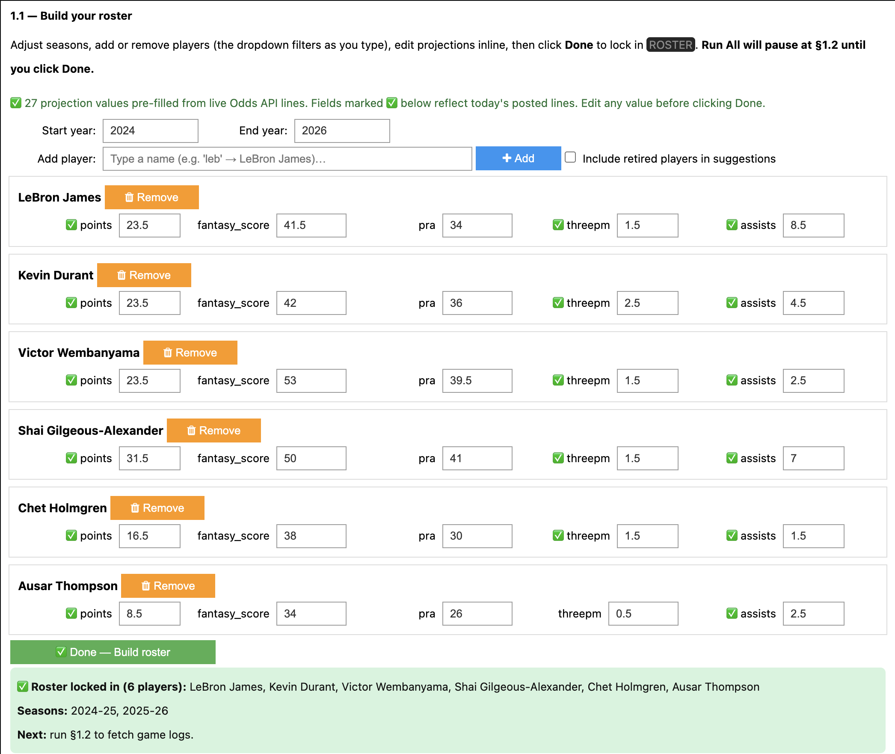
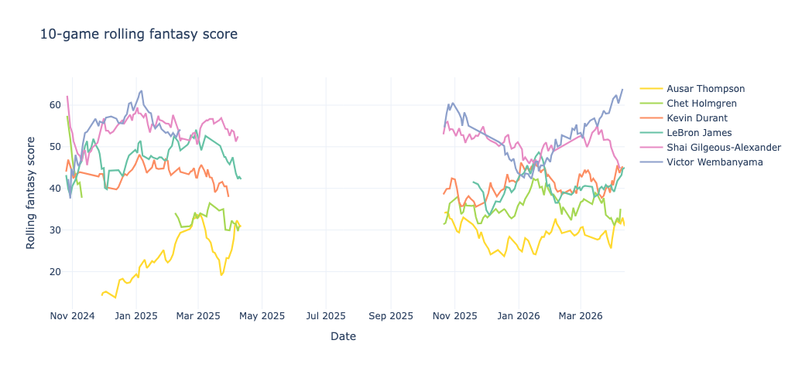
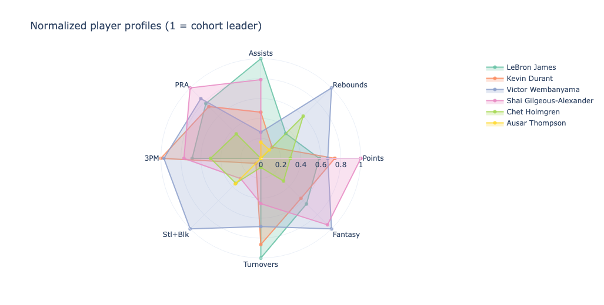
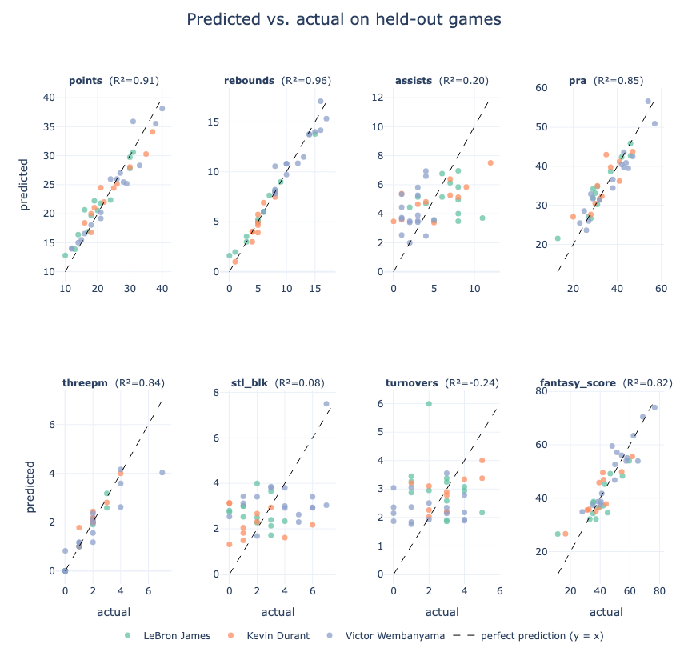
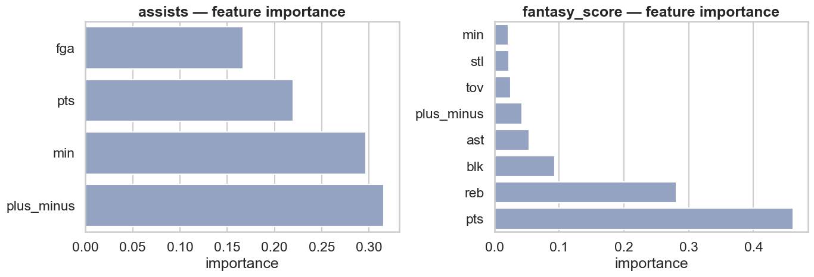
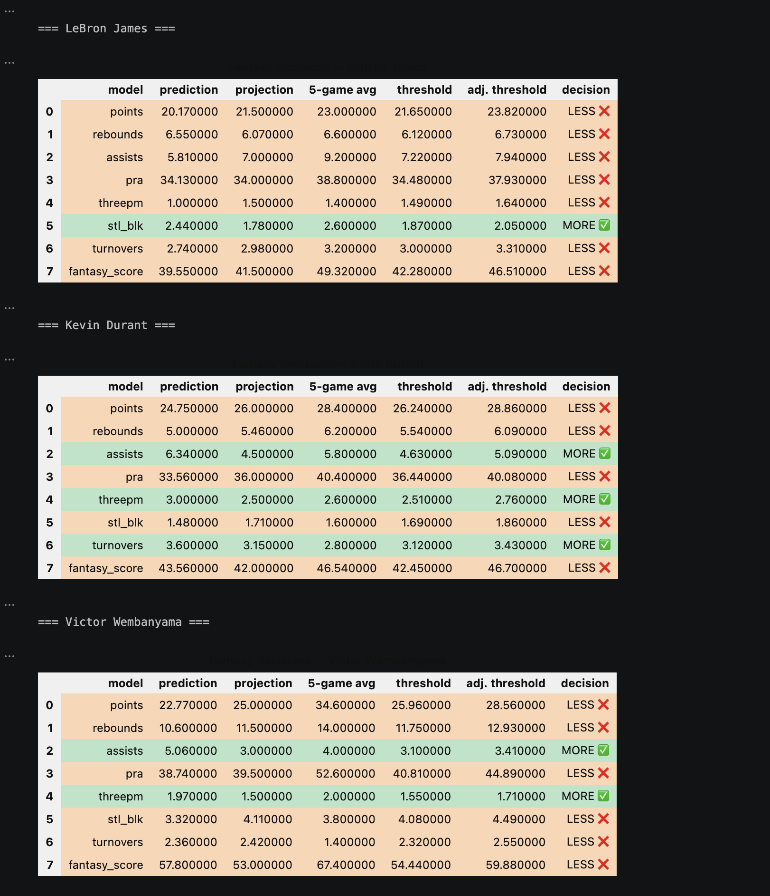
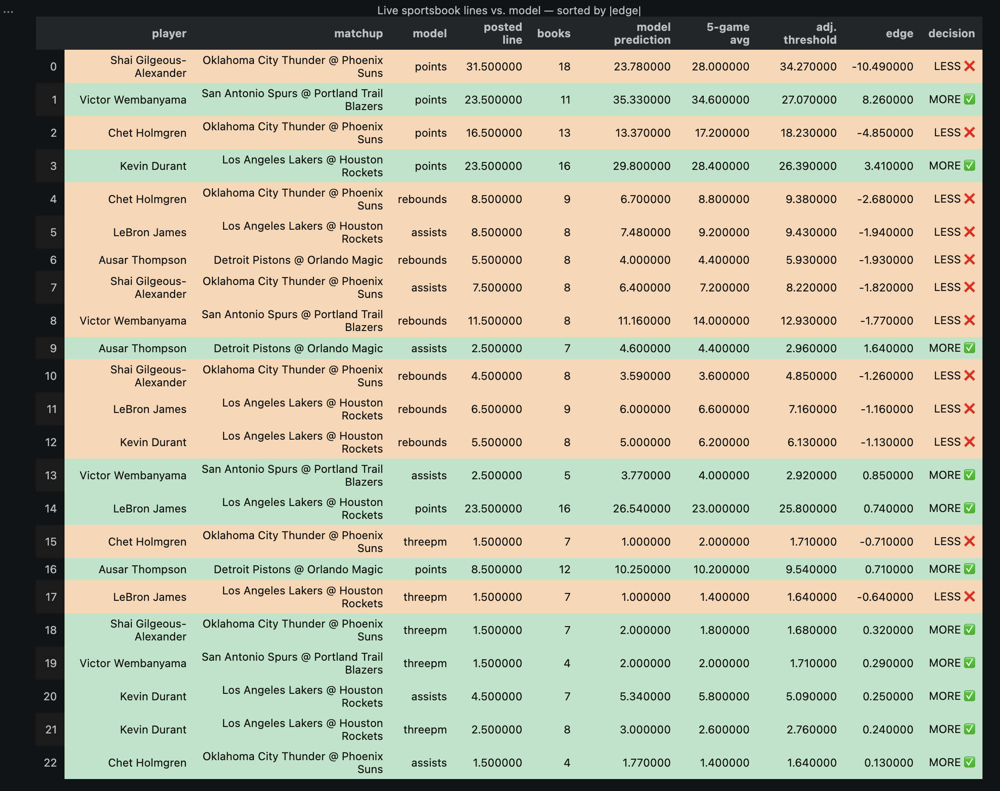

# 🏀 Hooplytics

> *Box scores in. Hot takes out.*


[](https://colab.research.google.com/github/texasbe2trill/hooplytics/blob/main/hooplytics.ipynb)

**Hooplytics** turns NBA game logs into stats, visualizations, and machine-learning-powered More/Less calls. It's the Python port of [hooplyticsR](https://github.com/texasbe2trill/hooplyticsR) — same spirit, but reborn as an interactive Jupyter notebook with modern ML, slicker plots, and a one-knob configuration.

Type a player's name. Get a real-time analytics report.

---

## 📑 Table of contents

- [⚡ TL;DR — just give me a prediction](#-tldr--just-give-me-a-prediction)
- [⛹️ What you get](#️-what-you-get)
- [🎞️ Gallery](#️-gallery)
- [🚀 Install & first run](#-install--first-run)
- [🎛️ The whole interface is one dictionary](#️-the-whole-interface-is-one-dictionary)
- [🎯 Three recipes for asking your own questions](#-three-recipes-for-asking-your-own-questions)
- [💰 Validate against live sportsbook lines](#-validate-against-live-sportsbook-lines)
- [📊 The models under the hood](#-the-models-under-the-hood)
- [🧠 Why a notebook (and not a script)?](#-why-a-notebook-and-not-a-script)
- [🛠️ Requirements](#️-requirements)
- [📁 Project layout](#-project-layout)
- [⚖️ Disclaimer](#️-disclaimer)
- [📄 License](#-license)

---

## ⚡ TL;DR — just give me a prediction

> *"I don't care about the math, I just want to know if I should take Wemby's points over tonight."*

**Three ways to use Hooplytics — pick the surface that fits.**

### 🖥️ Option A — Streamlit web UI (most visual)

```bash
git clone https://github.com/texasbe2trill/hooplytics.git
cd hooplytics && python3.11 -m venv .venv && source .venv/bin/activate
pip install -e .
hooplytics-web
```

A browser tab opens with five pages: **Player projection**, **Live edge board** (sorted by `|edge|`), **Compare players**, **Scenario lab**, and **Diagnostics**. A persistent **bet slip** lives in the sidebar. Set `ODDS_API_KEY` in `.env` to enable live lines.

### ⌨️ Option B — Typer CLI (fastest, scriptable)

```bash
pip install -e .
hooplytics project "Victor Wembanyama"
hooplytics prop "Shai Gilgeous-Alexander" points --line 31.5
hooplytics decisions "LeBron James"
hooplytics lines           # today's live edge board, sorted by |edge|
hooplytics roster add "Anthony Edwards"
hooplytics --help
```

Every command supports `--json` for piping. Fuzzy player matching means `hooplytics project lebron` resolves to LeBron James automatically.

### 📓 Option C — Jupyter notebook (deepest exploration)

```bash
pip install -e .[notebook]
jupyter lab hooplytics.ipynb
```

Then in the notebook:

1. **Hit `Run All`** (or `Restart and Run All`).
2. **The §1.1 roster builder launches automatically.** A 6-player default roster (LeBron, KD, Wembanyama, SGA, Chet Holmgren, Ausar Thompson — 2024→2026) is pre-loaded. If `ODDS_API_KEY` is set, today's live sportsbook lines auto-fill the projection fields. Click **✅ Done** to lock in, or edit first. First run downloads game logs (~30s); every run after is instant from the on-disk cache.
3. **Scroll to §6.3** and run the example cell. If `ODDS_API_KEY` is set, `line` is fetched automatically:
   ```python
   custom_prop(player="Victor Wembanyama", model_name="points")
   # ℹ️ Live line: Victor Wembanyama points = 23.5 — live (17 books)
   ```
   Output:
   ```python
   {'line source': 'live (17 books)', 'model prediction': 35.33, 'posted line': 23.5, '5-game avg': 34.6, 'adj. threshold': 27.07, 'edge': 8.26, 'call': 'MORE ✅'}
   ```
   No key? Just pass `line=<number>` manually.

That's it. The `'call'` field is the answer; everything else is the receipts. **`MORE ✅` / `LESS ❌` only fires when the model beats the line by more than a 10% confidence margin** — small edges are reported as `LESS ❌` on purpose.

> Want a player who isn't on your roster? `custom_prop` (§6.3) and `project_next_game` (§6.2) **fetch unknown players automatically** — pass any active NBA name and it'll pull the game logs for you.

### 🎯 Level it up — live sportsbook lines everywhere (optional, ~60 seconds)

Skip this if you just want a quick prediction. **Add it for a much sharper read** — every part of the notebook that shows a More/Less decision will use real posted consensus lines (DraftKings, FanDuel, BetMGM, Caesars…) instead of the defaults you typed:

| Where | Without key | With key |
|---|---|---|
| **§1.1 widget projections** | Static defaults (e.g. Wemby points = 25.0) | Auto-filled with today's live lines on load |
| **§5 More/Less tables** | Widget projections, no margin | Live lines with 10% confidence margin |
| **§5.1 sorted edge table** | Skipped | Full table sorted by `\|edge\|` |
| **§6.3 `custom_prop`** | Requires `line=<number>` | `line` optional — fetched automatically |

1. **Grab a free key** at [the-odds-api.com](https://the-odds-api.com/) — no credit card, 500 requests/month (one notebook run uses ~5–15).
2. **Store it securely** — pick whichever fits your setup:
   - **Google Colab:** 🔑 Secrets tab → **New secret** → Name: `ODDS_API_KEY` → toggle **Notebook access** on. Done — no files needed.
   - **Local:** `cp .env.example .env`, then paste your key after `ODDS_API_KEY=` in the new file (gitignored).
3. **Re-run from §1.1.** Done. Without a key, everything still runs — just with default projections and no margin.

---

## ⛹️ What you get

| Section | What it does |
|---|---|
| **§1.1 Roster builder** | Interactive **widget** with a live-search player dropdown and a season-range picker. Default seasons are **2024→2026**. When `ODDS_API_KEY` is set, today's live sportsbook lines **auto-fill the projection fields** on load — no manual entry needed. |
| **§2 Tale of the tape** | Per-player μ / σ / fantasy score. Color-graded tables. |
| **§2.1 Consistency leaderboard** | Coefficient of variation — *who can you actually trust on a Tuesday?* |
| **§3 Distributional vibes** | Faceted histograms with KDE overlays, side-by-side violin grid for every core stat. |
| **§3.2 Rolling form chart** | Interactive 10-game rolling fantasy line. Hover, isolate, compare. Season breaks render as visible gaps (no straight-line bridges across the offseason). |
| **§3.3 Player profile radar** | Min-max normalized polar chart — at-a-glance archetypes. |
| **§4 8 ML models** | scikit-learn `Pipeline`s tuned via `GridSearchCV`, evaluated on a 20% held-out split with RMSE / MAE / R². |
| **§4.2 Predicted-vs-actual scatter** | Eyeball calibration per stat. **Hover any dot to see the exact game (date + matchup) it came from.** |
| **§4.3 Random-forest importances** | What did the model *actually* learn? |
| **§5 More/Less engine** | Blends model predictions with posted lines + auto-derived 5-game form into per-stat decisions. Lines come from live sportsbooks (with 10% vig margin) when `ODDS_API_KEY` is set; falls back to widget projections (no margin) when not. A `source` column shows which was used. |
| **§5.1 Live sportsbook lines** *(optional)* | Re-uses the lines fetched in §5 to show **every player-prop sorted by `\|edge\|`** — strongest model–market disagreements at the top. Skip if you don't have an API key — auto-detects and no-ops. |
| **§6 Try it yourself** | Three runnable recipes for hypothetical scenarios, next-game projections, and custom prop bets. |

---

## 🎞️ Gallery

### §1.1 — Interactive roster builder



*Live-search dropdown with ipywidgets — works in VS Code, JupyterLab, and Google Colab. When `ODDS_API_KEY` is set, a status banner confirms how many projection fields were pre-filled from today's live sportsbook lines.*

### §3.2 — 10-game rolling fantasy score



*Wemby's line floats above the pack; KD's is a near-flatline (low CV). Built with Plotly — hover any point for game details. Offseason gaps render as visible line breaks rather than straight bridges.*

### §3.3 — Player profile radar



*Min-max normalized across the cohort so the chart shows relative strength, not raw counts.*

### §4.2 — Predicted vs. actual (held-out test set)



*8-panel Plotly scatter grid — one per model. Tight diagonal cloud on the deterministic stats, horizontal banding on the noisy ones (steals + blocks, turnovers). Hover any dot for date + matchup.*

### §4.3 — Random-forest feature importances



*Points dominates the fantasy-score model (as expected); rebounds is the next-biggest contributor because of Wemby's volume. Note: only `fantasy_score` uses a Random Forest — the other targets use kNN or Ridge.*

### §5 — Fantasy More/Less decisions



*Per-player, per-stat More/Less call. The `source` column shows `live` (Odds API with 10% vig margin), `widget` (your §1.1 entry, no margin), or `season avg` (fallback, no margin). Green = model beats the adjusted threshold; red = take the under.*

### §5.1 — Live sportsbook lines vs. model



*Every player-prop available for today's games, sorted by `|edge|` so the strongest model–market disagreements float to the top. The `books` column shows how many sportsbooks contributed to each consensus line — higher = sharper. Requires a free [Odds API](https://the-odds-api.com/) key.*

---

## 🚀 Install & first run

```bash
git clone https://github.com/texasbe2trill/hooplytics.git
cd hooplytics

python3.14 -m venv .venv
source .venv/bin/activate
pip install -r requirements.txt

jupyter lab hooplytics.ipynb
```

Run all cells (`⏵ Run All` / `Restart and Run All`). The first run pulls game logs from the NBA Stats API and caches them as Parquet under `data/cache/`; every subsequent run is instant.

> Headless / CI? `jupyter nbconvert --to notebook --execute hooplytics.ipynb` (you'll need to set `ROSTER` non-interactively — see below).

---

## 🎛️ The whole interface is one dictionary

§1.1 builds **`ROSTER`** for you interactively. If you'd rather skip the prompts and configure programmatically, replace the cell body with a literal dict:

```python
ROSTER = {
    "LeBron James":            {"seasons": CURRENT, "proj": {"points": 21.5, "fantasy_score": 41.5, "pra": 34.0}},
    "Kevin Durant":            {"seasons": CURRENT, "proj": {"points": 26.0, "fantasy_score": 42.0}},
    "Victor Wembanyama":       {"seasons": CURRENT, "proj": {"points": 25.0, "fantasy_score": 53.0}},
    "Shai Gilgeous-Alexander": {"seasons": CURRENT, "proj": {"points": 31.0, "fantasy_score": 50.0}},
    "Chet Holmgren":           {"seasons": CURRENT, "proj": {"points": 18.0, "fantasy_score": 38.0}},
    "Ausar Thompson":          {"seasons": CURRENT, "proj": {"points": 14.5, "fantasy_score": 34.0}},
    # Add a row, that's it 👇
    "Anthony Edwards":         {"seasons": nba_seasons(2024, 2026), "proj": {"points": 27.0}},
}
PLAYERS = list(ROSTER)
SEASONS = sorted({s for entry in ROSTER.values() for s in entry["seasons"]})
```

`seasons` accepts a list of NBA-style strings (`"2025-26"`); `nba_seasons(2023, 2026)` is a helper for ranges (`start` = first season tip-off year, `end` = last season's ending year). `proj` is optional — if you skip it, the player's season average becomes the baseline. **5-game averages auto-derive from the data**, so you never maintain them by hand.

> ⚠️ The **storyline prose** in §2, §2.1, §3.2, §4.1, and §4.3 was written for an earlier 3-player roster (LeBron / KD / Wemby). Tables and charts always reflect your live roster, but the prose is illustrative — each affected cell flags this inline.

---

## 🎯 Three recipes for asking your own questions

### 1. Score a hypothetical stat line

> *"What does the model predict if KD goes 9-of-16 from the field, 3-of-7 from three, in 36 minutes?"*

```python
predict_scenario(dict(
    fgm=9, fga=16, fg3m=3, fg3a=7, ftm=4, fta=4,
    min=36, fg_pct=0.563, fg3_pct=0.429, ft_pct=1.000,
    oreb=1, dreb=5, pts=25, reb=6, ast=4, stl=1, blk=0, tov=2, plus_minus=8,
))
```

Returns a table with predictions for every model whose features are satisfied by your scenario.

### 2. Project a player's next game from recent form

> *"What's Wemby expected to do tonight given his last 10 games?"*

```python
project_next_game("Victor Wembanyama", last_n=10)
```

Uses a rolling median (robust to outliers) of the player's actual recent box scores to feed every model. **Players not in your `ROSTER` are fetched automatically.**

### 3. Run a posted line through the decision engine

> *"Wemby's points line tonight is 24.5. Take the over?"*

```python
# Option A — let the engine fetch the live line automatically (requires ODDS_API_KEY)
custom_prop(player="Victor Wembanyama", model_name="points", last_n=5)
# ℹ️  Live line: Victor Wembanyama points = 23.5 — live (17 books)
# → {'line source': 'live (17 books)', 'model prediction': 35.33, 'posted line': 23.5, '5-game avg': 34.6, 'adj. threshold': 27.07, 'edge': 8.26, 'call': 'MORE ✅'}

# Option B — supply the line manually (no API key needed)
custom_prop(player="Victor Wembanyama", model_name="points", line=24.5, last_n=5)
# → {'line source': 'manual', 'model prediction': 35.33, 'posted line': 24.5, '5-game avg': 34.6, 'adj. threshold': 28.26, 'edge': 7.07, 'call': 'MORE ✅'}
```

The engine inflates the threshold by a 10% confidence margin so it only fires on conviction.

---

## 💰 Validate against live sportsbook lines

Setting `ODDS_API_KEY` unlocks three things at once — you don't need to do anything extra per section:

| When triggered | What happens |
|---|---|
| **§1.1 cell runs** | Widget projection fields are pre-filled with today's consensus lines for `points`, `rebounds`, `assists`, and `threepm` wherever available. A banner confirms how many were filled. |
| **§5 cell runs** | `fantasy_decisions()` uses live lines (with 10% vig margin) instead of widget defaults. |
| **§6.3 `custom_prop` with no `line=`** | Live line fetched on demand for any player with a game today. |

§5.1 re-uses the lines already fetched in §5 (no extra API calls) to render a full sorted-by-`|edge|` view across all props and players.

### Get a free API key (30 seconds)

1. Go to **[the-odds-api.com](https://the-odds-api.com/#get-access)** and click **Get API Key**.
2. Enter an email — no credit card, no phone number.
3. The key arrives in your inbox immediately.

The **free tier gives 500 requests/month**, which is plenty: one notebook run uses ~5–15 requests (1 to list events + 1 per upcoming NBA game).

### Use the key

The notebook reads `ODDS_API_KEY` from the **first** source it finds below — never hard-code it in the cell body, since `.ipynb` files are JSON and any committed key lives forever in git history.

**Option A — Google Colab Secrets *(Colab only)*.** No files to manage:

1. In Colab, click the **🔑 Secrets** icon in the left sidebar.
2. Click **New secret** → Name: `ODDS_API_KEY`, Value: your key.
3. Toggle **Notebook access** on.

The cell calls `google.colab.userdata.get('ODDS_API_KEY')` automatically and loads the value into the environment — nothing else to do.

**Option B — `.env` file *(recommended locally)*.** A `.env.example` is included; copy it and fill in your key:

```bash
cp .env.example .env
# then edit .env and paste your key after ODDS_API_KEY=
```

`.env` is already in `.gitignore`, so it can't be committed by accident.

**Option C — shell export.** One-off, doesn't touch the repo:

```bash
export ODDS_API_KEY=your-key-here
jupyter lab hooplytics.ipynb
```

Then re-run from §1.1. **Without a key, everything still runs** — widget defaults, no margin, no errors.

> 🔐 If you ever paste a key directly into the notebook by mistake, [revoke it](https://the-odds-api.com/account/) and request a new one. Don't try to scrub it from git history — assume the moment a key hits a public repo, it's compromised.

### Which markets are pulled

Out of the box: `points`, `rebounds`, `assists`, and `3PM`. To add more (e.g. `player_blocks`, `player_steals`), edit the `ODDS_MARKETS` dict in the **imports cell** (cell 4, just below the key setup). The market keys live in The Odds API's [NBA player props docs](https://the-odds-api.com/sports-odds-data/betting-markets.html#player-props-api).

---

## 📊 The models under the hood

| Target          | Model            | Predictors                                          |
|-----------------|------------------|-----------------------------------------------------|
| `pts`           | kNN (tuned)      | `fgm, fg3m, ftm, min, fg_pct, ft_pct`               |
| `reb`           | kNN (tuned)      | `oreb, dreb, min`                                   |
| `ast`           | Ridge (tuned)    | `ast_l5, ast_l10, ast_l30, ast_per36_l30, min_l10, usg_proxy_l30` |
| `pra`           | kNN (tuned)      | `pts, reb, ast, min, plus_minus`                    |
| `fg3m`          | kNN (tuned)      | `fg3a, min, fg3_pct`                                |
| `stl_blk`       | Ridge (tuned)    | `stl_l10, blk_l10, stl_l30, blk_l30, stl_per36_l30, blk_per36_l30, min_l30` |
| `tov`           | Ridge (tuned)    | `tov_l5, tov_l10, tov_l30, tov_per36_l30, min_l10, usg_proxy_l30, ast_l10, fga_l10` |
| `fantasy_score` | RandomForest     | `pts, reb, ast, stl, blk, tov, min, plus_minus`     |

> **Pregame-safe rolling features** — the `_l5` / `_l10` / `_l30` suffixes are per-player rolling means over the **prior 5 / 10 / 30 games** (computed via `groupby('player').shift(1).rolling(N).mean()`, so the current game is never in its own feature row — no leakage). `_per36_l30` normalizes a stat to a per-36-minute rate, and `usg_proxy_l30 = (FGA + 0.44·FTA + TOV) / MIN` rolled over 30 games. The noisy "context" targets (`ast`, `stl_blk`, `tov`) get these rolling features because their game-to-game variance is dominated by player role / usage rather than same-game proxies — same-game features capped them at R² ≤ 0.20.
>
> **Why Ridge for the noisy targets?** kNN and Random Forest overfit when the rolling-window features are highly collinear (they encode overlapping recent history). Ridge's L2 penalty turns that collinearity into a feature: it learns a stable linear blend across the windows so the prediction tracks both short-term form (`_l5`) and the player's longer-run baseline (`_l30`).
>
> **A note on `stl_blk` and `tov` — the noise floor is real.** Per-game steals+blocks and turnovers are dominated by Poisson-like within-player noise. We verified this with an *oracle* sanity check: even predicting these targets from the player's **same-game** minutes, FGA, FGM, plus_minus, etc. (features no honest pregame model could ever see) caps Random Forest at R² ≈ **0.12–0.13** on the 6-player default roster. In other words, the per-game grain has so little explainable signal that *no* feature set or model can clear R² ≥ 0.40 — the variance simply isn't there to explain. Current results: `stl_blk` R² ≈ 0.16, `tov` R² ≈ 0.09 (both up from R² ≤ 0.10 / R² ≈ −0.24 before the rolling-features rework). For comparison, `assists` — which has real between-player signal — cleanly hit **R² ≈ 0.47** with the same machinery. **Treat the `stl_blk` and `tov` predictions as weak priors, not point estimates**, and rely on the More/Less engine's confidence margin (§5) when betting these stats.

- **Pipelines** wrap `StandardScaler` + estimator so scaling is fit on training folds only (no leakage). The RF pipelines use `StandardScaler(with_mean=False)` since trees don't need centering.
- **kNN** tuned over `n_neighbors ∈ [3, 21]` (`weights="distance"`) via `GridSearchCV` with **5-fold repeated CV** (2 repeats), mirroring the original R `caret` setup.
- **Random Forest** tunes `n_estimators ∈ {200, 400}`, `max_depth ∈ {None, 10, 20}`, and `min_samples_leaf ∈ {1, 3}`.
- **80/20 train/test split**, seed `123` everywhere, scoring = `neg_root_mean_squared_error`.

**Fantasy scoring (no double-double bonuses):** `pts·1 + reb·1.2 + ast·1.5 + stl·3 + blk·3 − tov·1`.

---

## 🧠 Why a notebook (and not a script)?

The original project is an R Markdown narrative report — prose, tables, plots, and modeling output, all interleaved. A Jupyter notebook is the natural Python analog: it preserves the section-by-section storytelling, renders styled pandas tables and interactive Plotly charts inline, and lets you iterate on a single section without rerunning the whole pipeline.

A pure script would lose the narrative. A dashboard would lose the source-of-truth code. The notebook gets both.

---

## 🛠️ Requirements

- **Python 3.11+** (`typing.NotRequired` requires 3.11; 3.14 was used during development)
- See [requirements.txt](requirements.txt)

> Running in **Google Colab**? Click the badge at the top — packages install automatically from the first cell. No local Python setup needed.

---

## 📁 Project layout

```
hooplytics/
├── hooplytics.ipynb     # the whole report
├── README.md            # you are here
├── LICENSE
├── requirements.txt
├── .gitignore
├── .env.example         # copy to .env (gitignored) and add your ODDS_API_KEY
├── docs/                # rendered HTML of the notebook (e.g. for GitHub Pages)
│   ├── index.html
│   └── assets/          # README gallery screenshots
│       ├── roster-builder.png
│       ├── rolling-form-chart.png
│       ├── player-radar.png
│       ├── predicted-vs-actual.png
│       ├── feature-importance.png
│       ├── fantasy-decisions.png
│       └── sportsbook-validation.png
└── data/cache/          # Parquet game-log cache, one file per player (gitignored)
```

---

## ⚖️ Disclaimer

Hooplytics is for analytical exploration and entertainment. The "MORE ✅ / LESS ❌" calls are not investment advice. Bet responsibly — or better yet, don't bet at all and just enjoy the math.

Game log data is fetched at runtime from the NBA Stats API and is **not redistributed** with this project. See the [NBA Terms of Use](https://www.nba.com/termsofuse).

---

## 📄 License

MIT © 2026 [Chris Campbell](https://github.com/texasbe2trill). See [LICENSE](LICENSE) for details.
