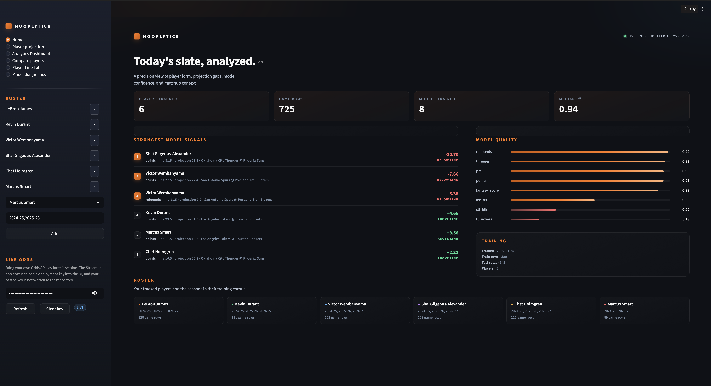
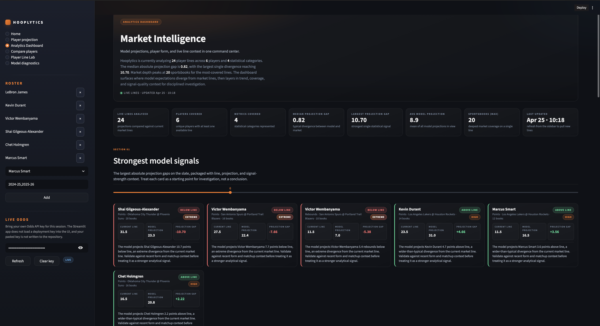
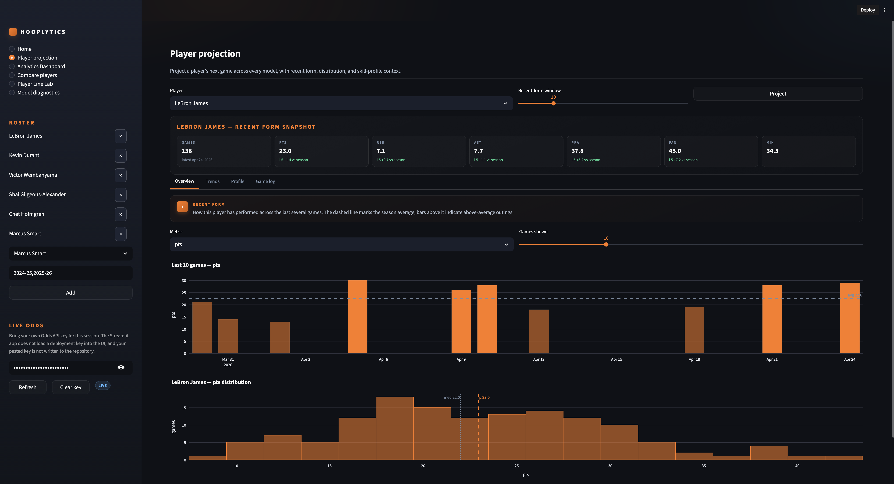
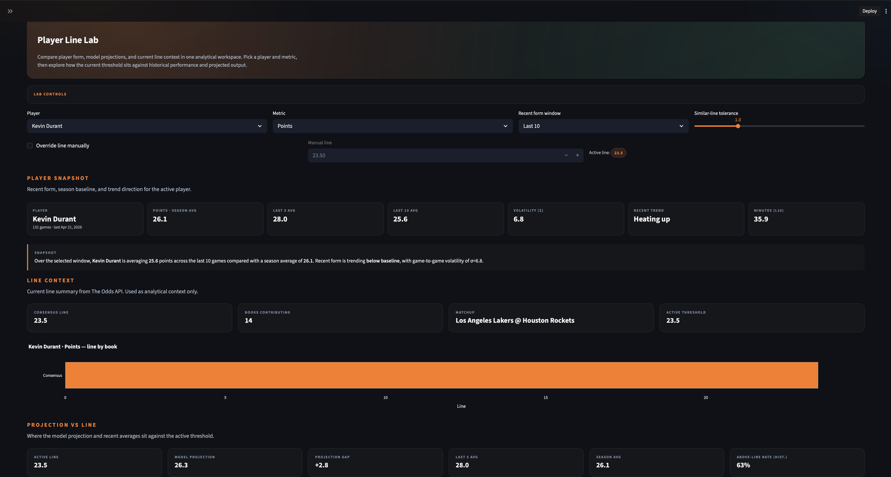
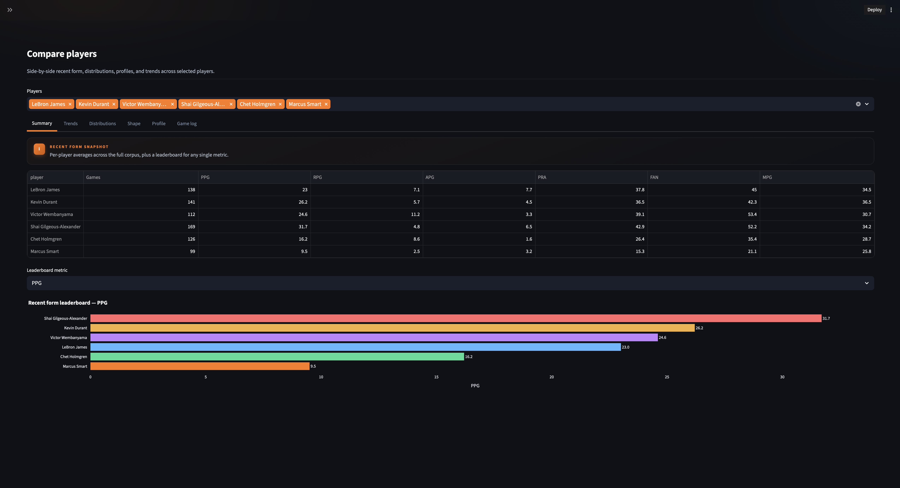
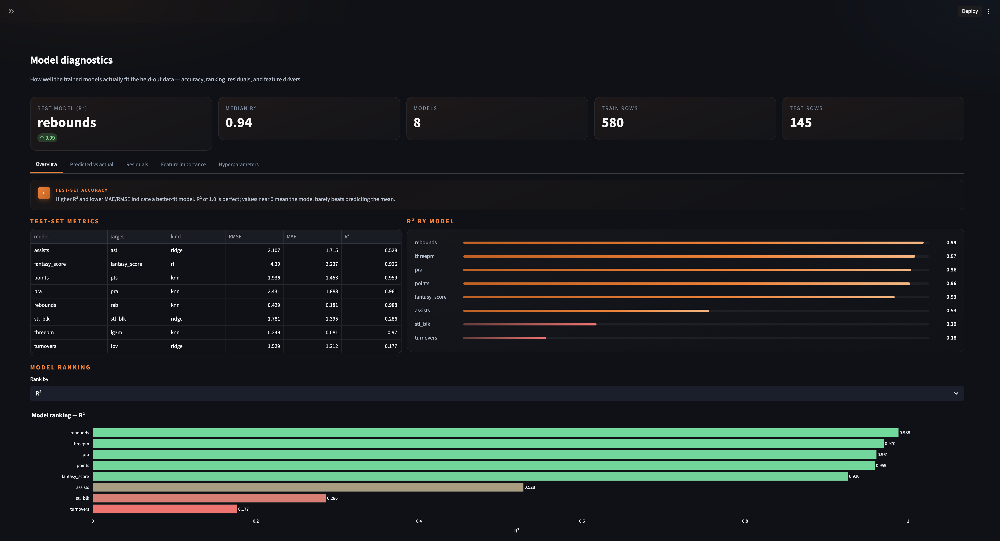

<div align="center">

# 🏀 Hooplytics

### *An NBA player intelligence workbench.*

**Project the next game · Study any line · Pull live odds — straight from your terminal, notebook, or browser.**

<br>

[](LICENSE)
[](https://www.python.org/)
[](https://the-odds-api.com/)
[](https://colab.research.google.com/github/texasbe2trill/hooplytics/blob/main/hooplytics.ipynb)
[](https://hooplytics.streamlit.app)

<br>

[**Quick Start**](#-tldr) ·
[**First 5 Minutes**](#-your-first-5-minutes-with-hooplytics) ·
[**Live Lines**](#-live-lines-made-analytical) ·
[**Dashboard**](#-app-preview) ·
[**CLI**](#-cli-walkthrough) ·
[**Modeling**](#-analytics-approach) ·
[**Roadmap**](#-roadmap)

</div>

<br>

> **Hooplytics turns NBA game logs into a modern analytics workflow.** Model projections, recent-form trends, historical threshold studies, and live market context — designed to help you *explore, explain, and challenge* the numbers, not hand you a magic prediction.

<br>

<table>
<tr>
<td width="33%" valign="top">

### 🎛️ Streamlit dashboard
Click-driven analytics for the modern fan. Eight purpose-built pages, an AI scout, and a printable PDF report.

```bash
hooplytics-web
```

</td>
<td width="33%" valign="top">

### ⚡ Typer CLI
Rich-rendered tables, scriptable end to end, `--json` friendly.

```bash
hooplytics --help
```

</td>
<td width="33%" valign="top">

### 📓 Jupyter notebook
Reproducible, narrative-first exploration with charts inline.

```bash
jupyter lab hooplytics.ipynb
```

</td>
</tr>
</table>

> Lines from The Odds API are treated as **analytical thresholds** — comparison points for projections, distributions, and historical outcomes. **Hooplytics is analytics-first.**

---

## 🚀 TL;DR

Already know what you want? Here is the fast path.

```bash
git clone https://github.com/texasbe2trill/hooplytics.git && cd hooplytics
python3 -m venv .venv && source .venv/bin/activate && pip install -e .
```

| I want to… | Command |
| :--- | :--- |
| 🎛️ &nbsp; Open the dashboard | `hooplytics-web` |
| 🎯 &nbsp; Project a player's next game | `hooplytics project "Jalen Brunson"` |
| 📈 &nbsp; Compare a projection vs. a live line | `hooplytics prop "Shai Gilgeous-Alexander" points` |
| 📊 &nbsp; See the live line board | `hooplytics lines --refresh` |
| 📑 &nbsp; Generate a printable scouting report | Open the dashboard → **Roster Report** → *Generate PDF* |
| 🏋️ &nbsp; Generate a coaching performance report | Open the dashboard → **Roster Report** → *Player Performance Analytics* |
| 🤖 &nbsp; Ask the AI scout a question | Open the dashboard → **Hooplytics Scout** |
| ❓ &nbsp; See all CLI commands | `hooplytics --help` |
| 📓 &nbsp; Open the notebook | `jupyter lab hooplytics.ipynb` |

> 💡 **Tip:** set `ODDS_API_KEY` in `.env` and `prop` will auto-fetch the line for you — no `--line` needed.

---

## 🏀 Your First 5 Minutes With Hooplytics

New here? This is the smoothest path to **"oh, that's actually useful"** — and you don't even have to install anything.

<table>
<tr>
<td width="50px" align="center" valign="top"><h2>1️⃣</h2></td>
<td valign="top">
<strong>Open the live app — no install required</strong><br>
Go to <a href="https://hooplytics.streamlit.app/"><strong>hooplytics.streamlit.app</strong></a>. The hosted Streamlit app loads instantly with a pre-shipped roster of stars and a high-accuracy <strong>RACE</strong> model bundle already in memory — zero training, zero waiting. Multiple bundles ship in <code>bundles/</code> and you can switch between them in the sidebar (see <a href="#-choosing-a-model-bundle">Choosing a model bundle</a>).
<br><br>
<sub>Prefer to run it locally? <code>pip install -e . && hooplytics-web</code> opens the same app at <code>http://localhost:8501</code>.</sub>
</td>
</tr>
<tr>
<td align="center" valign="top"><h2>2️⃣</h2></td>
<td valign="top">
<strong>Land on Home — see today's slate at a glance</strong><br>
You’ll see roster coverage, model-quality medians, and a roll-up of strong edges. This is your control tower.
</td>
</tr>
<tr>
<td align="center" valign="top"><h2>3️⃣</h2></td>
<td valign="top">
<strong>(Optional) Paste your Odds API key in the sidebar</strong><br>
Get a free key at <a href="https://the-odds-api.com/">the-odds-api.com</a>, paste it into the sidebar password field, and the entire app lights up with live market lines and a real edge board. The key stays in session memory — never written to disk or sent anywhere except The Odds API.
</td>
</tr>
<tr>
<td align="center" valign="top"><h2>4️⃣</h2></td>
<td valign="top">
<strong>Open <em>Analytics Dashboard</em> → read the slate</strong><br>
This is the fastest way to find tonight’s biggest projection-vs-line gaps. Sort by signed edge, filter by call (MORE / LESS), and use the <em>Strong</em> badge to surface the highest-conviction rows.
</td>
</tr>
<tr>
<td align="center" valign="top"><h2>5️⃣</h2></td>
<td valign="top">
<strong>Drill into a player on <em>Player Projection</em></strong><br>
Pick a player from the sidebar to see their next-game projection across all 8 models, recent form trend, distribution context, and the model’s read versus the live line.
</td>
</tr>
<tr>
<td align="center" valign="top"><h2>6️⃣</h2></td>
<td valign="top">
<strong>Generate a printable scouting PDF</strong><br>
Go to <em>Roster Report</em> → click <strong>Generate PDF</strong>. You get a branded, multi-page report with KPI tiles, a signal spotlight, R² lollipops, diverging edge charts, and per-player hero blocks — ready to share.
</td>
</tr>
<tr>
<td align="center" valign="top"><h2>7️⃣</h2></td>
<td valign="top">
<strong>(Optional) Talk to <em>Hooplytics Scout</em></strong><br>
Paste your OpenAI key in the sidebar, click <strong>Connect</strong>, and ask things like <em>“Give me a MORE/LESS read on the largest edge tonight, with confidence and risk factors.”</em> The Scout is grounded in your local data and structured for confidence + risk, not hot takes.
</td>
</tr>
</table>

> 🎯 **In a hurry?** The first three steps are the bare minimum. Steps 4–7 are where the real fun lives.

---

## ✨ What Makes Hooplytics Different

Most NBA tools either dump descriptive stats or hand you a single prediction with no context. **Hooplytics sits in the middle.**

<table>
<tr>
<td width="50%" valign="top">

#### 🎯 Projections, not promises
Eight model families, side-by-side, with held-out diagnostics in plain view.

#### 📡 Lines as analytical thresholds
The Odds API tells you what the market thinks; Hooplytics shows you how that compares to recent form, distributions, and history.

#### 🧭 Three surfaces, one mental model
Streamlit for visuals, CLI for speed, notebook for reproducibility.

</td>
<td width="50%" valign="top">

#### 🔍 No black boxes
Feature importance, residuals, calibration plots, and per-stat health summaries are first-class citizens.

#### 🛡️ Pregame-safe by design
Rolling features are computed from prior games only — no leakage, no surprises.

#### 🧪 Honest about noise
Lower-signal categories (steals + blocks, turnovers) are framed as such — always.

</td>
</tr>
</table>

---

## 📡 Live Lines, Made Analytical

Drop an `ODDS_API_KEY` in `.env` and the entire CLI lights up with live market data.

```bash
# Live line board for the tracked roster, sorted by projection gap
hooplytics lines --refresh

# Single-stat: projection vs. auto-fetched live line
hooplytics prop "Shai Gilgeous-Alexander" points

# Full 8-stat decision view with live lines folded in
hooplytics decisions "Victor Wembanyama"
```

**What you see in your terminal:**

| Column | Meaning |
| :--- | :--- |
| `model prediction` | The model's expected value for the next game |
| `posted line` | The market line pulled live from The Odds API |
| `5-game avg` | The player's recent-form baseline |
| `adj. threshold` | Vig-adjusted line used for the gap calculation |
| `edge` | Signed gap between the projection and the threshold |
| `call` | Directional signal (`MORE` / `LESS`) for analytical comparison |

> 🔓 **No key? No problem.** Every command still works — you just lose the live-line column.

---

## 🎬 See It In Motion

<div align="center">


</div>

---

## 🖼️ App Preview

The Streamlit app ships with **eight** purpose-built pages, each focused on a different analytics workflow.

<table>
<tr>
<td width="50%" valign="top" align="center">



#### 🏠 Home
Portfolio-style overview of roster coverage, model outputs, and high-level telemetry.

</td>
<td width="50%" valign="top" align="center">



#### 📊 Analytics Dashboard
Command center for projection gaps, signal quality, coverage, and live line telemetry.

</td>
</tr>
<tr>
<td width="50%" valign="top" align="center">



#### 🎯 Player Projection
Next-game projection with recent form, distribution context, and supporting visuals.

</td>
<td width="50%" valign="top" align="center">



#### 🧪 Player Line Lab
Historical outcome study around a selected player, metric, and current threshold.

</td>
</tr>
<tr>
<td width="50%" valign="top" align="center">



#### ⚖️ Compare Players
Side-by-side form, distributions, profile shape, and game logs.

</td>
<td width="50%" valign="top" align="center">



#### 🔬 Model Diagnostics
Held-out model quality, ranking, residuals, and feature drivers.

</td>
</tr>
<tr>
<td colspan="2" valign="top">
<h4>🤖 Hooplytics Scout</h4>
<p>Bring-your-own-key OpenAI chatbot grounded in your local roster, projections, model metrics, and live edge rows. Hybrid mode by default — general NBA reasoning is allowed but explicitly labeled. Toggle <strong>Strict grounded</strong> in the sidebar to force answers that only cite local data. Pick suggestions always include structured <strong>Confidence</strong> and <strong>Risk factors</strong> sections, never a guarantee.</p>
<p>🔑 <strong>Key setup:</strong> Paste your OpenAI key in the sidebar, or set <code>OPENAI_API_KEY</code> in <code>.env</code> / Streamlit secrets.</p>
<p>🤝 <strong>Connect:</strong> Click <strong>Connect</strong> — available chat models are fetched from your key and the best GPT-style model is auto-selected.</p>
<p>💬 <strong>Ask anything:</strong> <em>"Give me a MORE/LESS read on the largest edge tonight, with confidence and risk factors."</em></p>
<p>🔒 <strong>Grounding modes:</strong> <strong>Hybrid</strong> (default) allows labeled general NBA reasoning · <strong>Strict</strong> only cites local data.</p>
<p>🛡️ <strong>Privacy:</strong> Your key stays in session memory only — never written to disk or printed in logs.</p>
</td>
</tr>
<tr>
<td colspan="2" valign="top">
<h4>📑 Roster Report (PDF)</h4>
<p>One-click, print-ready editorial scouting report built with ReportLab — no headless browser required. Pulls directly from the live model bundle, edge board, and (optional) AI scout context. Designed to read like a magazine: serif display type, cream paper, hairline rules, and color-coded OVER / UNDER signals throughout.</p>
<p>📰 <strong>Tonight's Slate (cover):</strong> Headline call-out for the loudest mispricing, divergent edge skyline of every live signal, and KPI rail (players, live signals, median R²).</p>
<p>🎯 <strong>Tonight's Setup:</strong> Anchor / Differentiator / Secondary cards with confidence chips, recent-form sparkline, and the ranked Top-4 signal cards.</p>
<p>📊 <strong>Signal Board:</strong> Full ranked board of every live edge with side, projection vs. line, hit %, confidence, and book counts.</p>
<p>🧭 <strong>Conviction Map:</strong> Numbered scatter (|edge| vs. book depth) with quadrant labels (SLEEPER / HEADLINE / SKIP / CROWD PLAY), a polished Signal Index legend mapping each marker to player · market · edge, and two AI Scout Picks with full untruncated rationale.</p>
<p>🔬 <strong>Model Quality:</strong> Composite trust meter on the left and per-target reliability lollipops on the right.</p>
<p>👤 <strong>Per-player profiles:</strong> Hero block with tonight's call · recent-form pills · last-4 resolved lines · sparklines · model projection vs. line table · full latest context and analyst notes from the AI scout.</p>
<p>Open the <strong>Roster Report</strong> page, click <em>Generate PDF</em>, and download.</p>
</td>
</tr>
<tr>
<td colspan="2" valign="top">
<h4>🏋️ Player Performance Analytics (PDF)</h4>
<p>A second printable report on the same Roster Report page — strictly performance-oriented (no betting edges, no projection-vs-line content). Designed for coaching staffs, player development, and anyone who wants the same magazine chrome focused on how a player is actually playing.</p>
<p>📰 <strong>Cover:</strong> Roster headline scoreboard with PTS / REB / AST / TS% per player, deep-linked names that jump straight to that player's profile page.</p>
<p>📋 <strong>Roster overview:</strong> Per-player season averages snapshot table plus a roster skill overlay radar so you can see every player's skill shape on a single chart.</p>
<p>📈 <strong>Per-player profile (2 pages each):</strong> Dark hero band with headline averages · KPI scorecard strip with L10 deltas · Garmin-style activity rings (SCORING / PLAYMAKING / EFFICIENCY vs. roster leader) · ML next-game projection panel (linear-regression forecast with 80% prediction interval and trend arrows) · trend sparklines for 8 stats over the last 20 games with rolling-5 overlay · shooting & efficiency bars (FG% / 3P% / FT% / TS%) with roster-median markers · skill-axis radar · floor / median / ceiling consistency strip · role & usage trends · hot/cold streak detection (z-scored vs. season baseline) · three accent-topped coaching cards (Strengths / Growth / Focus) with optional AI-augmented narrative.</p>
<p>Open the <strong>Roster Report</strong> page, switch the report-type toggle to <em>Player Performance Analytics</em>, and click <em>Generate performance report</em>.</p>
</td>
</tr>
</table>

<details>
<summary><strong>📓 Notebook gallery</strong> &nbsp;— earlier-era visualizations from the Jupyter workflow</summary>

<br>

<table>
<tr>
<td width="50%" align="center">


<sub>Roster setup with searchable player selection</sub>

</td>
<td width="50%" align="center">


<sub>Recent-form view with hoverable game detail</sub>

</td>
</tr>
<tr>
<td width="50%" align="center">


<sub>Held-out predicted-vs-actual diagnostics</sub>

</td>
<td width="50%" align="center">


<sub>Feature importance across model types</sub>

</td>
</tr>
</table>

</details>

---

## 🤔 Questions Hooplytics Helps You Answer

A player intelligence workbench is built to make data easier to *explore, explain, and challenge* — not to hand you a magic number.

- 🔮 What does this player's recent form actually look like?
- 📐 How does the model projection compare with tonight's posted line?
- 📈 Is the player trending above or below their season baseline?
- 🎚️ Which signals are stable, and which are noisy?
- 🗓️ How often has the player finished above similar thresholds historically?
- 🧭 Where do diagnostics suggest confidence — and where do they suggest caution?

---

## 🧠 Under the Hood

<table>
<tr>
<td valign="top">

- 🏀 Builds player-level datasets from NBA game logs via `nba_api`
- 🛡️ Engineers rolling and per-36 features for **pregame-safe** modeling
- 🤖 Trains eight projection models across core counting stats and fantasy score
- 📡 Pulls live line context from **The Odds API** for projection-vs-line comparison

</td>
<td valign="top">

- 📊 Visualizes recent form, distributions, profiles, residuals, and importance
- 🧪 Supports historical outcome studies and threshold sensitivity analysis
- 🧭 Same workflow through a notebook, a CLI, and a Streamlit dashboard
- 🔁 Reproducible end-to-end with cached datasets and pipelines

</td>
</tr>
</table>

---

## 🌟 Feature Highlights

| Area | Highlights |
| :--- | :--- |
| 🎛️ **Streamlit dashboard** | Eight purpose-built pages: Home, Player Projection, Analytics Dashboard, Compare Players, Player Line Lab, Model Diagnostics, Hooplytics Scout, Roster Report |
| 📑 **PDF Roster Report** | Editorial, magazine-style ReportLab PDF — Tonight's Slate cover, Tonight's Setup card stack, ranked Signal Board, Conviction Map with Signal Index legend and AI Scout Picks, Model Quality trust meter, and per-player profiles with latest context, sparklines, and last-4 resolved lines |
| 🏋️ **PDF Player Performance Analytics** | Second coach-focused PDF on the same page — KPI scorecards, Garmin-style activity rings, ML next-game projection with 80% prediction interval, trend sparklines, shooting & efficiency bars, skill-axis radar, floor/median/ceiling consistency, role & usage trends, hot/cold streak z-scores, and three accent-topped coaching cards (Strengths / Growth / Focus) |
| 🤖 **Hooplytics Scout (AI)** | BYO-key OpenAI chatbot grounded in your local roster, projections, edge board, and model metrics — Hybrid or Strict grounded modes, structured Confidence + Risk factors |
| 📡 **Live line context** | Auto-fetched lines from The Odds API across CLI and dashboard, with session-only BYO-key support in the web app |
| 🎯 **Edge board** | Slate-wide projection-vs-line gap analysis, signed edges, MORE/LESS calls, and book counts — feeds the dashboard, the AI scout, and the PDF report |
| 👤 **Player analysis** | Recent form, rolling trends, distributions, player profiles, season averages, and recent-window comparisons |
| 🧠 **Modeling stack** | RACE blend (Ridge + kNN + Random Forest pipelines) across eight target stats, role and context features |
| 🎚️ **Market-anchored calibration** | Two-layer calibration applied at inference (Huber per-market `actual ≈ a + b·line` + per-player residual mean clipped to ±20%) blended with the model via per-market weights — corrects systematic bias without retraining. Built with `hooplytics-build-calibration` and shipped as `bundles/calibration_v1.json` |
| 📦 **Prebuilt RACE bundles** | Multiple ready-to-use bundles ship in `bundles/` (e.g. `race_fast.joblib`, `race_playoffs.joblib`). The Streamlit app auto-loads one on launch and lets you switch between them from the sidebar — zero cold-start training required |
| 🔬 **Diagnostics** | RMSE / MAE / R², predicted-vs-actual panels, residual views, feature importance, and per-stat health summaries |
| ⚡ **CLI workflows** | Single-player projection, prop comparison, scenario inputs, live line board, roster persistence, and prebuilt-bundle training |
| 📓 **Notebook workflow** | Rich exploratory narrative with tables, charts, code, and reproducible analysis in one place |

---

## ⚖️ Analytics first

Lines from The Odds API are treated as **analytical inputs** — thresholds to compare against projections, recent form, and historical outcomes. Hooplytics uses them to ask better questions:

- How far is the model projection from the current line?
- Is recent form above or below the season baseline?
- How volatile is the player around this threshold?
- How often has the player finished above similar thresholds?
- Does the model signal agree with historical performance?

> Hooplytics is a statistical analysis project for learning, exploration, and visualization.

---

## ⚡ CLI Walkthrough

Hooplytics ships with a Typer-based CLI that renders to **Rich** tables and panels in your terminal. Reproducible, scriptable, and `--json` friendly.

### Available commands

| Command | Purpose |
| :--- | :--- |
| `hooplytics project` | Project a player's next game across all 8 models |
| `hooplytics prop` | Compare a player projection against a posted line for a single stat |
| `hooplytics decisions` | 8-stat projection summary with model-vs-line gap analysis |
| `hooplytics scenario` | Score a hypothetical box-score JSON payload |
| `hooplytics lines` | Live line board for the tracked roster, sorted by projection gap |
| `hooplytics train` | Pre-warm and cache the model bundle |
| `hooplytics-train-bundle` | Interactive prebuilt bundle trainer with progress bars and R2 validation gates |
| `hooplytics-build-calibration` | Fit the market-anchored calibration artifact (`bundles/calibration_v1.json`) from cached odds + game logs |
| `hooplytics roster list` | Show the tracked roster |
| `hooplytics roster add` | Add a player to the tracked roster |
| `hooplytics roster remove` | Remove a player from the tracked roster |

### Example CLI usage

```bash
# Next-game projection across all 8 models
hooplytics project "Victor Wembanyama"

# Single-stat comparison — line auto-fetched from The Odds API
hooplytics prop "Shai Gilgeous-Alexander" points

# Same comparison with an explicit line override
hooplytics prop "Shai Gilgeous-Alexander" points --line 31.5

# 8-stat decision view, no live lines (offline mode)
hooplytics decisions "LeBron James" --no-live

# Live line board, freshly fetched
hooplytics lines --refresh

# Score a what-if box-score row
hooplytics scenario '{"fgm":8,"fga":15,"fg3m":3,"ftm":4,"min":34,"fg_pct":0.53,"ft_pct":1.0,"oreb":1,"dreb":5}'

# Roster + cache management
hooplytics roster add "Anthony Edwards"
hooplytics train

# Build and ship a prebuilt Streamlit bundle (defaults to bundles/race_fast.joblib)
hooplytics-train-bundle --mode exhaustive --players-source postseason-plus-anchors

# Fit the market-anchored calibration artifact from cached odds (used automatically by predict)
hooplytics-build-calibration build --season 2024-25 --season 2025-26 --verbose
```

> 🔑 `hooplytics lines` and live-enabled `prop` / `decisions` need `ODDS_API_KEY` (from `.env` or your shell). All commands support `--help`, and most reporting commands support `--json` for scripting.

---

## 📦 Installation

<table>
<tr>
<td width="33%" valign="top">

#### Base install

```bash
git clone https://github.com/texasbe2trill/hooplytics.git
cd hooplytics

python3 -m venv .venv
source .venv/bin/activate
pip install -e .
```

</td>
<td width="33%" valign="top">

#### With notebook extras

```bash
pip install -e .[notebook]
```

Adds Jupyter, ipywidgets, and notebook-only visualization helpers.

</td>
<td width="33%" valign="top">

#### Web / Streamlit only

```bash
pip install -r requirements.txt
```

Minimal install for Streamlit Cloud or web-only deploys. Does not include notebook deps.

</td>
</tr>
</table>

> **Requires Python 3.11 or later.**

---

## 🔐 Configuration

The Odds API is used as **optional** market and line context. Three safe ways to supply a key:

| Method | How |
| :--- | :--- |
| 📄 **Local `.env`** | Copy `.env.example` → `.env`, set `ODDS_API_KEY=your_key` |
| 🐚 **Shell session** | `export ODDS_API_KEY=your_key` |
| 🌐 **Streamlit sidebar** | Paste your key into the sidebar password field — session-only, never stored |

```bash
cp .env.example .env
# then edit .env and set ODDS_API_KEY=your_key_here
```

> 🔓 If no key is configured, Hooplytics still works. You simply lose the optional live line context.

---

## 🛠️ Usage

### 🎛️ Streamlit dashboard — the recommended starting point

```bash
hooplytics-web
```

This launches the full multi-page dashboard at `http://localhost:8501`. A pre-trained **RACE** model bundle ships with the repo at `bundles/race_fast.joblib` and is auto-loaded — you get production-quality projections instantly, no training step required.

<table>
<tr>
<td valign="top" width="33%">
<strong>🔑 Sidebar setup (optional)</strong><br>
• Paste your <strong>Odds API key</strong> to enable live lines and the edge board.<br>
• Paste your <strong>OpenAI key</strong> under <em>Hooplytics Scout</em> to enable the AI assistant.<br>
• Both keys are session-only — never written to disk.
</td>
<td valign="top" width="33%">
<strong>📍 Where to go first</strong><br>
• <strong>Home</strong> for the slate overview.<br>
• <strong>Analytics Dashboard</strong> for the live edge board.<br>
• <strong>Player Projection</strong> for a single-player deep dive.<br>
• <strong>Roster Report</strong> to export a branded PDF.<br>
• <strong>Hooplytics Scout</strong> to chat with your data.
</td>
<td valign="top" width="34%">
<strong>👥 Roster management</strong><br>
The sidebar lets you add or remove tracked players. Changes are persisted locally between sessions, so your roster is ready to go next time you launch the app.
</td>
</tr>
</table>

### ⚡ CLI

```bash
hooplytics --help                        # browse all commands
hooplytics roster list                   # see who's tracked
hooplytics project "Jalen Brunson" --last-n 10
hooplytics lines --refresh               # fresh live line board
```

### 🎚️ Choosing a model bundle

Hooplytics ships multiple pretrained bundles in [`bundles/`](bundles/) so you can switch model behavior without retraining. The default app launch uses `race_fast.joblib`.

**In the Streamlit sidebar:**

1. Make sure **Use prebuilt model bundle** is checked (it is by default).
2. A **Bundle** dropdown appears right below it listing every `.joblib` file found in `bundles/`.
3. Pick a bundle — the app reloads automatically. All projections, the edge board, the AI scout, and the PDF report immediately reflect the new bundle.

| Bundle | Best for |
| :--- | :--- |
| 🏃 **`race_fast.joblib`** | Default. Broad regular-season coverage trained on a large rolling window. Fast to load, balanced across all 8 stat targets. |
| 🏆 **`race_playoffs.joblib`** | Playoff-tuned variant. Weighted toward higher-stakes, lower-pace games — useful for postseason slates. |

> 💡 **Power users:** drop any additional `*.joblib` you trained with `hooplytics-train-bundle` into `bundles/` and it appears in the dropdown on next reload. To pin a non-default bundle headlessly, set `HOOPLYTICS_PRETRAINED_BUNDLE=/abs/path/to/your.joblib` in `.env` or your Streamlit secrets.

### 📓 Jupyter workflow

```bash
jupyter lab hooplytics.ipynb
```

Follow the notebook top-to-bottom for the full narrative analysis, or jump to a section.

---

## 📚 Data Sources

| Source | Used for |
| :--- | :--- |
| 🏀 `nba_api` | NBA player game logs and player metadata |
| 📡 The Odds API | Optional live line and book-count context |
| 💾 Local cache | Parquet/JSON caching for faster repeated workflows |

> Hooplytics does not redistribute NBA game data. All data is fetched at runtime.

---

## 🧪 Analytics Approach

Hooplytics emphasizes transparent, pregame-safe modeling rather than black-box outputs.

### Targets

| Model name | Target |
| :--- | :--- |
| `points` | `pts` |
| `rebounds` | `reb` |
| `assists` | `ast` |
| `pra` | `pts + reb + ast` |
| `threepm` | `fg3m` |
| `stl_blk` | `stl + blk` |
| `turnovers` | `tov` |
| `fantasy_score` | `fantasy_score` |

### Modeling principles

> 🛡️ **Pregame-safe.** Rolling windows are computed from prior games only — no leakage.
>
> 🧱 **Pipelines, not magic.** Scaling and feature handling stay inside scikit-learn pipelines, train/test boundaries intact.
>
> ⚖️ **Compare, don't hide.** Multiple model families are shown side by side instead of collapsing to one number.
>
> 🔬 **Diagnostics are first-class.** Calibration, residuals, and feature importance are surfaced everywhere, not buried.
>
> 🧪 **Honest about noise.** Steals + blocks and turnovers are framed as lower-signal categories — always.

---

## 📁 Project Structure

```text
hooplytics/
├── hooplytics.ipynb              # Narrative notebook workflow
├── README.md
├── pyproject.toml
├── requirements.txt
├── docs/
│   ├── index.html
│   ├── assets/                   # Notebook-era visualizations
│   └── screenshots/              # Streamlit dashboard captures
├── bundles/
│   ├── race_fast.joblib          # Default RACE bundle auto-loaded by the app
│   ├── race_playoffs.joblib      # Playoff-tuned RACE bundle (selectable in sidebar)
│   └── calibration_v1.json       # Market-anchored calibration artifact (auto-applied by predict)
├── hooplytics/
│   ├── cli.py                    # Typer CLI entry point
│   ├── constants.py
│   ├── data.py                   # Game log ingestion + caching
│   ├── fantasy.py
│   ├── features_context.py       # Pace / matchup / opponent context
│   ├── features_market.py        # Market-aware features
│   ├── features_role.py          # Role / usage features
│   ├── models.py                 # 8-stat RACE model training
│   ├── odds.py                   # The Odds API client
│   ├── openai_agent.py           # Hooplytics Scout (BYO-key OpenAI grounding)
│   ├── predict.py                # Projection + line comparison (auto-applies calibration)
│   ├── calibration.py            # Two-layer market-anchored calibration
│   ├── calibration_cli.py        # `hooplytics-build-calibration` entry point
│   ├── report.py                 # PDF Roster Report builder (ReportLab)
│   ├── report_performance.py     # PDF Player Performance Analytics builder (ReportLab)
│   ├── train_bundle.py           # Interactive prebuilt-bundle trainer
│   └── web/
│       ├── app.py                # Streamlit multi-page app
│       ├── charts.py
│       ├── launcher.py           # `hooplytics-web` entry point
│       └── styles.py
└── tests/
```

---

## 🗺️ Roadmap

- 🎬 Fresh Streamlit dashboard screenshots and rendered demos for the Roster Report and Hooplytics Scout pages
- 📡 Richer book-level line telemetry inside the Streamlit app
- 🧪 Expanded Player Line Lab sensitivity views
-  Saveable / shareable PDF report templates with custom branding
- 📦 More reproducible demo datasets for first-time users
- 👥 Broader player and season presets for faster onboarding

---

## ⚠️ Disclaimer

> Hooplytics is for **statistical analysis, education, and entertainment**.
>
> Line values are used as contextual inputs for comparing model projections, recent form, and historical outcomes. The project is **not an execution system and not a guarantee of future results**.

---

## 🤝 Contributing

Issues and pull requests are welcome, especially around:

- 🤖 model quality and calibration
- 🎨 UX improvements for the dashboard or CLI
- 📊 additional visualization layers
- 📚 documentation and reproducibility

---

## 📜 License & Acknowledgements

**MIT © 2026 [Chris Campbell](https://github.com/texasbe2trill)**

Hooplytics is the Python evolution of [hooplyticsR](https://github.com/texasbe2trill/hooplyticsR), with additional dashboarding, modeling, and CLI tooling.

**Built on the shoulders of:**

- 🏀 the [`nba_api`](https://github.com/swar/nba_api) project for accessible NBA stats endpoints
- 📡 [The Odds API](https://the-odds-api.com/) for optional live line context
- 📊 [Plotly](https://plotly.com/), [Streamlit](https://streamlit.io/), [Typer](https://typer.tiangolo.com/), [Rich](https://rich.readthedocs.io/), [pandas](https://pandas.pydata.org/), and [scikit-learn](https://scikit-learn.org/) for the core application stack

<div align="center">

<br>

*If Hooplytics helps you think more clearly about player performance, consider giving the repo a ⭐.*

</div>
